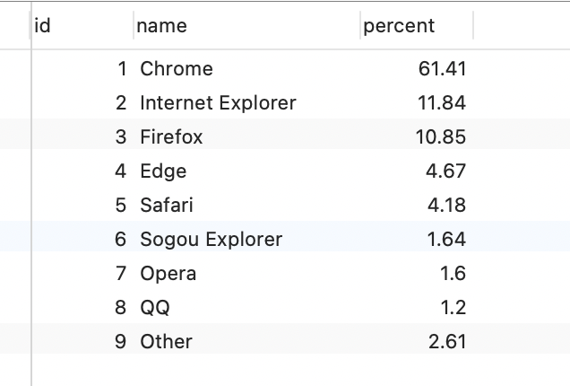

# HighCharts


# HighCharts概述

​	Highcharts 是一个用纯 JavaScript 编写的一个图表库， 能够很简单便捷的在 Web 网站或是 Web 应用程序添加有交互性的图表，并且免费提供给个人学习、个人网站和非商业用途使用。

​	Highcharts 支持的图表类型有直线图、曲线图、区域图、柱状图、饼状图、散状点图、仪表图、气泡图、瀑布流图等多达 20 种图表，其中很多图表可以集成在同一个图形中形成混合图。

## 应用场景


## 图表主要组成

一般情况下，Highcharts 包含**标题**（Title）、**坐标轴**（Axis）、**数据列**（Series）、**数据提示框**（Tooltip）、**图例**（Legend）、**版权标签**（Credits）等，另外还可以包括**导出功能按钮**（Exporting）等。

Highcharts 基本组成部分如下图所示


### 1. 标题（Title）

图表标题，包含标题和副标题（subTitle），其中副标题不是必须的。

### 2. 坐标轴（Axis）

坐标轴包含x轴（xAxis）和y轴（yAxis）。通常情况下，x轴显示在图表的底部，y轴显示在图表的左侧。多个数据列可以共同使用同一个坐标轴，为了对比或区分数据，Highcharts提供了多轴的支持。

### 3. 数据列（Series）

数据列即图表上一个或多个数据系列，比如曲线图中的一条曲线，柱状图中的一个柱形。

### 4. 数据提示框（Tooltip）

当鼠标悬停在某点上时，以框的形式提示该点的数据，比如该点的值、数据单位等。数据提示框内提示的信息可以通过格式化函数动态指定。

### 5. 图例（Legend）

图例是图表中用不同形状、颜色、文字等 标示不同数据列，通过点击标示可以显示或隐藏该数据列。

### 6. 版权标签（Credits）

显示在图表右下方的包含链接的文字，默认是Highcharts官网地址。通过指定credits.enabled=false即可不显示该信息。

### 7. 导出功能（Exporting）

通过引入 exporting.js即可增加图表导出为常见文件功能。


# HighCharts结合后端实践

### 开发环境与开发组件：

1. 开发工具Intellij IDEA 
2. jQuery 3.2.1+ Highcharts-6.0.7
3. Web容器：Tomcat8.5.57
4. 数据库MySQL 5.7.10
5. 数据库访问技术：C3P0连接池+DbUtils工具包
6. Web层：Servlet + HTML5
7. flexjson，jackson将数据库查询到的数据转成JSON格式
8. 使用JUnit进行单元测试

### 需求分析：

1. 利用jQuery+Ajax+HighCharts打造项目图表，显示表格数据
2. 在mysql数据库中有各种数据
3. 将信息从数据库中读取出来以表格的形式显示在HTML页面上

### 效果：


### 开发步骤：

#### 1. 数据库

##### 条形图


##### 饼图




##### 折线图


#### 2. 后端：

##### 项目结构


##### json格式转换

创建Servlet，在Servlet调用业务层，将查询到的数据转换成JSON对象，打印到浏览器端。

这里我采用了两种方式

1. flexjson

```java
import flexjson.JSONSerializer;

@WebServlet("/explorer")
public class ExplorerServlet extends HttpServlet {

    private final ExplorerService explorerService = new ExplorerService();

    protected void doPost(HttpServletRequest request, HttpServletResponse response) throws ServletException, IOException {
        //指定相应类型为JSON
        response.setContentType("text/json;charset=utf-8");
        PrintWriter out = response.getWriter();
        //调用业务层访问数据
        List<Explorer> explorers = explorerService.findAllExplorers();
        //创建JSON转换对象
        JSONSerializer serializer = new JSONSerializer();
        serializer.exclude("class");
        String serialize = serializer.serialize(explorers);
        //输出到客户端
        out.print(serialize);

    }

    protected void doGet(HttpServletRequest request, HttpServletResponse response) throws ServletException, IOException {
        this.doPost(request,response);
    }
}
```

2. jackson

```java
import com.fasterxml.jackson.databind.ObjectMapper;

@WebServlet("/CountryWeather")
public class CountryWeatherServlet extends HttpServlet {

    private final CountryWeatherService countryWeatherService = new CountryWeatherService();

    protected void doPost(HttpServletRequest request, HttpServletResponse response) throws ServletException, IOException {

        response.setContentType("text/json;charset=utf-8");
        PrintWriter out = response.getWriter();

        List<CountryWeather> countryWeathers = countryWeatherService.findAllCountryWeathers();
        List<Map<String,Object>> data = new ArrayList<>();
        Set<String> names = new HashSet<>();
        for(CountryWeather c : countryWeathers){
            names.add(c.getName());
        }
        int k = 0;
        for(String name : names){
            Map<String,Object> map = new HashMap<>();
            List<Object> ts = new ArrayList<>();
            if (k > 0){
                ts.clear();
                k = 0;
            }
            for(CountryWeather c : countryWeathers){
                if (name.equals(c.getName())){
                    ts.add(c.getData());
                }
            }
            map.put("name",name);
            map.put("data",ts);
            data.add(map);
            k++;
        }

        ObjectMapper objectMapper = new ObjectMapper();
        String res = objectMapper.writeValueAsString(data);
        out.print(res);

    }

    protected void doGet(HttpServletRequest request, HttpServletResponse response) throws ServletException, IOException {
        this.doPost(request,response);


    }
}
```


#### 3. 前端图表配置

Highcharts 实例化中绑定容器的方式有很多种方式

##### 通过构造函数

```
var charts = Highcharts.chart('container', {
  // Highcharts 配置
});
```

##### 如果页面已经引入了 jQuery，那么还可以 jQuery 插件的形式调用

```
$("#container").highcharts({
    // Highcharts 配置  
}); 
```

1. 创建HTML5，在网页中创建一个div，指定宽和高。导入jquery，hightcharts和自己写的explorer.html文件

```html
<!DOCTYPE html>
<html lang="en">
<head>
    <meta charset="UTF-8">
    <title>浏览器</title>
    <script src="js/jquery-3.2.1.min.js"></script>
    <script src="js/highcharts.js"></script>
    <script src="js/explorer.js"></script>
</head>
<body>
    <div id="container3" style="min-width:400px;height:400px"></div></body>
</html>
```


2. 在js目录下创建employee.js，利用jQuery从服务器上读取数据，生成姓名和数据这2列

```javascript
$(function (){
    //使用ajax从服务器加载数据
    $.get("explorer",function (data){
        init(data);
    })
})

function init(data) {
    var dataArray = [];//新建一个数据
    for(var i=0;i<data.length;i++){
        var name = data[i].name;
        var percent = data[i].percent;
        var obj = {};//新建一个对象
        obj.name = name;
        obj.y = percent;
        dataArray.push(obj);
    }
    //创建图表
    var options = {
        chart:{
            type:'pie'
        },
        //指定主标题
        title:{
            text:'浏览器占比'
        },
        //设置数据列
        series:[{
            name:'浏览器占比',
            colorByPoint: true,
            data: dataArray
        }]
    };

    //放在div中显示出来
    $("#container3").highcharts(options);
}
```

### 官方案例效果：

### 

### 官方代码：

``` javascript
Highcharts.chart('container', {
	chart: {
		plotBackgroundColor: null,
		plotBorderWidth: null,
		plotShadow: false,
		type: 'pie'
	},
	title: {
		text: '2018年1月浏览器市场份额'
	},
	tooltip: {
		pointFormat: '{series.name}: <b>{point.percentage:.1f}%</b>'
	},
	plotOptions: {
		pie: {
			allowPointSelect: true,
			cursor: 'pointer',
			dataLabels: {
				enabled: true,
				format: '<b>{point.name}</b>: {point.percentage:.1f} %',
				style: {
					color: (Highcharts.theme && Highcharts.theme.contrastTextColor) || 'black'
				}
			}
		}
	},
	series: [{
		name: 'Brands',
		colorByPoint: true,
		data: [{
			name: 'Chrome',
			y: 61.41,
			sliced: true,
			selected: true
		}, {
			name: 'Internet Explorer',
			y: 11.84
		}, {
			name: 'Firefox',
			y: 10.85
		}, {
			name: 'Edge',
			y: 4.67
		}, {
			name: 'Safari',
			y: 4.18
		}, {
			name: 'Sogou Explorer',
			y: 1.64
		}, {
			name: 'Opera',
			y: 1.6
		}, {
			name: 'QQ',
			y: 1.2
		}, {
			name: 'Other',
			y: 2.61
		}]
	}]
});
```

